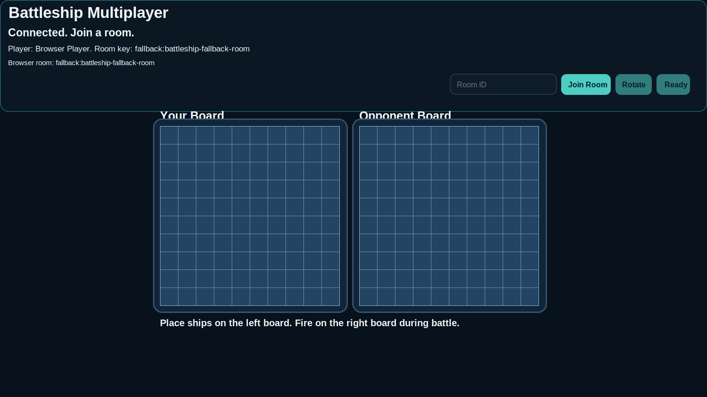

# Battleship Multiplayer Frontend



Frontend for Battleship game  `PixiJS` and connected to a WebSocket server.  10x10 


## Run

Requires `Node.js 18+`.

```bash
npm install
cp .env.example .env
npm run dev
```

The Vite dev server runs on `http://localhost:5173`.

## Build

```bash
npm run build
```

Build artifacts are written to `../server/public`

## Configuration

Example env values from [`.env.example`]:

```env
VITE_WS_URL=wss://your-backend.example.com
VITE_FALLBACK_ROOM=battleship-public-room
```

- `VITE_WS_URL` - explicit backend WebSocket endpoint
- `VITE_FALLBACK_ROOM` - fallback room key when no room is provided through query params

If `VITE_WS_URL` is not set, the client:

- connects to `ws://<host>:3000` in Vite dev mode
- uses the current page host in other environments

## WebSocket Protocol

The client sends and receives plain JSON messages in this shape:

```json
{
  "type": "message_type",
  "payload": {}
}
```

Connection metadata is appended to the WebSocket URL query string by [`src/NetworkClient.js`]. The current client sends `roomKey`, `userId`, `username`, `channelId`, `guildId`, `instanceId`, and `source`

### Outbound Client Requests

These are the messages the frontend sends to the backend:

- `create_or_join`
  Used when the player joins a room from the lobby.

```json
{
  "type": "create_or_join",
  "payload": {
    "roomId": "alpha-room"
  }
}
```

- `place_ships`
  Sends the full normalized fleet after local validation.

```json
{
  "type": "place_ships",
  "payload": {
    "ships": [
      {
        "id": "ship-0",
        "size": 4,
        "cells": [
          { "x": 0, "y": 0 },
          { "x": 1, "y": 0 },
          { "x": 2, "y": 0 },
          { "x": 3, "y": 0 }
        ]
      }
    ]
  }
}
```

- `player_ready`
  Confirms that ship placement is complete.

```json
{
  "type": "player_ready",
  "payload": {}
}
```

- `shoot`
  Sent during battle when the local player fires at the opponent board.

```json
{
  "type": "shoot",
  "payload": {
    "x": 4,
    "y": 7
  }
}
```

- `restart_request`
  Sent after the game ends when the player wants to restart the match.

```json
{
  "type": "restart_request",
  "payload": {}
}
```

### Inbound Events

These are the events the frontend listens 

- `connected`
  Expected fields: `playerId`, `roomKey`, `username`
- `room_joined`
  Expected fields: `roomId`, `playerIndex`, `playersInRoom`
- `waiting_for_opponent`
  No payload required
- `placement_accepted`
  Expected fields: `youReady`, `youPlacedShips`, `opponentReady`, `opponentPlacedShips`
- `placement_error`
  Expected fields: `message`
- `battle_started`
  Expected fields: `currentTurnPlayerId`
- `turn_changed`
  Expected fields: `currentTurnPlayerId`
- `shot_result`
  Expected fields: `x`, `y`, `result`, `nextTurnPlayerId`
  Optional fields used by the client: `gameOver`, `winnerId`, `sunkShipCells`
- `opponent_shot`
  Expected fields: `x`, `y`, `result`, `nextTurnPlayerId`
  Optional fields used by the client: `gameOver`, `winnerId`, `sunkShipCells`
- `ship_sunk`
  Expected fields: `target`, `cells`
- `game_over`
  Expected fields: `winnerId`
  Optional fields: `reason`
- `error`
  Expected fields: `message`
- `socket_closed`
  Expected fields: `code`, `reason`, `url`

### Listener Expectations

The scene listeners assume the following payload semantics:

- `result` in `shot_result` and `opponent_shot` is compared against `"miss"`. Any other value is treated as a hit.
- `sunkShipCells` and `cells` are arrays of board coordinates shaped like `{ "x": number, "y": number }`.
- `target` in `ship_sunk` must be either `"opponent"` or `"player"` so the client knows which board to update.
- `currentTurnPlayerId`, `nextTurnPlayerId`, and `winnerId` must use the same identifier space as `playerId` from `connected`.
- `room_joined` is the event that moves the client from lobby to placement mode and hides room controls.
- `placement_accepted` is expected to reflect both local and remote readiness so the client can switch between placement, waiting, and battle preparation states.

### Example Server Responses

Successful connection:

```json
{
  "type": "connected",
  "payload": {
    "playerId": "p1",
    "roomKey": "fallback:battleship-public-room",
    "username": "Browser Player"
  }
}
```

Start battle:

```json
{
  "type": "battle_started",
  "payload": {
    "currentTurnPlayerId": "p1"
  }
}
```

Resolve a shot:

```json
{
  "type": "shot_result",
  "payload": {
    "x": 4,
    "y": 7,
    "result": "hit",
    "nextTurnPlayerId": "p2",
    "sunkShipCells": [
      { "x": 4, "y": 6 },
      { "x": 4, "y": 7 }
    ],
    "gameOver": false
  }
}
```
